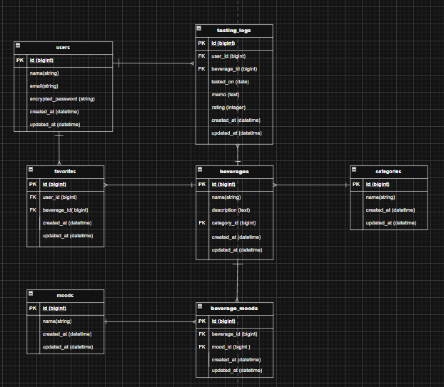

## ER図

本アプリで使用する全テーブル・カラム・リレーションを整理し、  
MVP時点の状態を反映したER図を作成しました。

---

## 本サービスの概要（700文字以内）

「sake手帳」は、「今日の気分」からお酒を提案し、飲んだお酒を記録できるアプリです。  
お酒選びにおいては、種類や専門用語が多く、特に初心者にとっては「何を基準に選べばよいかわからない」という課題があると考えます。また、既存のレビューサイトは知識がある人向けの情報が中心で、気軽に選びたい層にはハードルが高いと感じました。

酒手帳では、味や銘柄の知識を前提とせず、「リラックスしたい」といったような感覚的な気分を起点にお酒を選べる点を特徴としています。ユーザーは気分を選択することで、その気分に合ったお酒の一覧を確認でき、詳細情報を見たうえで実際に飲んだお酒を記録として残すことができます。また、お気に入り機能により、後から飲みたいお酒を管理することも可能です。

主な想定ユーザーは、お酒に興味はあるものの専門知識があまりないライト層です。  
気分起点のシンプルな導線により、お酒選びの心理的ハードルを下げ、体験を記録・振り返ることができるサービスを目指すことができればと考えています。

---

## MVPで実装する予定の機能

- ユーザー登録 / ログイン機能（Devise）
- 気分選択機能
- 気分に応じたお酒おすすめ一覧表示機能
- お酒詳細表示機能
- 飲酒記録の投稿・一覧表示機能
- お気に入り登録・解除機能
- マイページ機能（飲酒記録・お気に入りの確認）

---

## テーブル詳細

### users（ユーザー）
- id : bigint / 主キー
- name : string / ユーザー表示名
- email : string / ログイン用メールアドレス
- encrypted_password : string / パスワード（Devise）
- created_at : datetime / 作成日時
- updated_at : datetime / 更新日時

### categories（カテゴリ）
- id : bigint / 主キー
- name : string / カテゴリ名（例：ビール）
- created_at : datetime
- updated_at : datetime

### beverages（お酒）
- id : bigint / 主キー
- name : string / お酒名
- description : text / 説明文
- category_id : bigint / カテゴリID（外部キー）
- created_at : datetime
- updated_at : datetime

### moods（気分）
- id : bigint / 主キー
- name : string / 気分名（例：リラックス）
- created_at : datetime
- updated_at : datetime

### beverage_moods（お酒×気分 中間テーブル）
- id : bigint / 主キー
- beverage_id : bigint / お酒ID（外部キー）
- mood_id : bigint / 気分ID（外部キー）
- created_at : datetime
- updated_at : datetime

### favorites（お気に入り）
- id : bigint / 主キー
- user_id : bigint / ユーザーID（外部キー）
- beverage_id : bigint / お酒ID（外部キー）
- created_at : datetime
- updated_at : datetime

### tasting_logs（飲酒記録）
- id : bigint / 主キー
- user_id : bigint / ユーザーID（外部キー）
- beverage_id : bigint / お酒ID（外部キー）
- tasted_on : date / 飲んだ日
- memo : text / メモ
- rating : integer / 評価
- created_at : datetime
- updated_at : datetime

---

## ER図の注意点（セルフチェック）
自分なりにチェックをしました。

- [x] プルリクエストに最新のER図のスクリーンショットを画像表示できている
- [x] テーブル名は複数形になっている
- [x] カラムの型を記載している
- [x] 外部キーを適切に設けている
- [x] 多対多の関係は中間テーブルで解消している
- [x] STIは使用していない
- [x] "テーブル名 + カラム名" の冗長な命名をしていない
